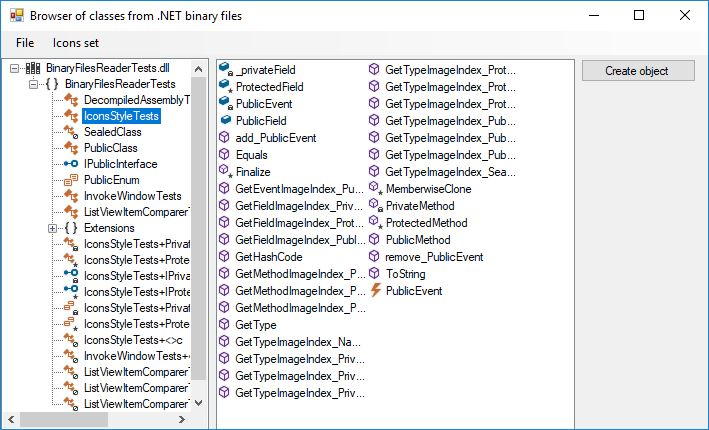
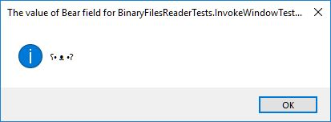
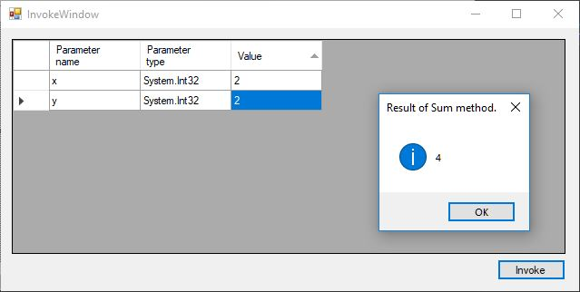

## Binary Files Reader
This program allows you to read an **.exe* or **.dll* file and list objects that are compiled into this file.

The list on the left contains a tree structure of files that were opened. It lists:
* namespaces
* classes
* interfaces
* enums

The list on the right appears after choosing a certain class or interface. It lists objects that are defined in the chosen type such as:
* constants
* fields
* properties
* methods
* events

### Creating and manipulating an instance of an object
If the type provides a public parameterless constructor, the application gives you a possibility to create an instance of this type.  

If an instance of a type is available, it's possible to see values that are assigned to fields by double clicking on them.

It's also possible to invoke methods that require no or just simple type parameters.
